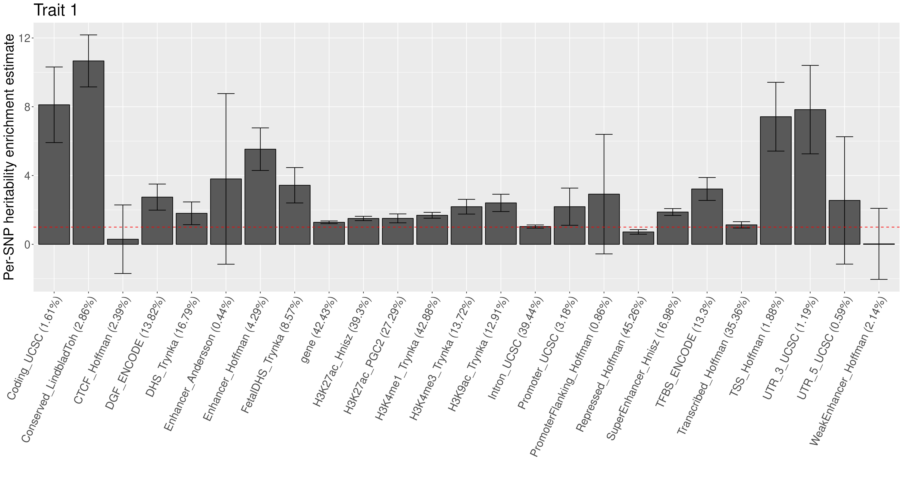

!!! note  
    All utility scripts used in the examples are documented in [Utilities](util.md).

## Simulated datasets

### QTL-MAS 2012
- The dataset is available for download [here](https://github.com/jiang18/mph/raw/main/examples/QTL-MAS-2012.zip).
- [This article](https://bmcproc.biomedcentral.com/articles/10.1186/1753-6561-8-S5-S1) describes how the dataset was simulated.
- 3k related animals, 10k SNPs, 5 chromosomes, and 3 traits

### Sequence genotypes
- The dataset is available for download [here](https://doi.org/10.6084/m9.figshare.24432948).
- Sequence genotypes were simulated by [genosim](https://aipl.arsusda.gov/software/genosim/).
- 10k unrelated individuals, 5M sequence variants, and 30 chromosomes
- Functional annotations were quickly simulated by assigning [LDSC baseline annotations](https://console.cloud.google.com/storage/browser/_details/broad-alkesgroup-public-requester-pays/LDSCORE/1000G_Phase3_baseline_ldscores.tgz) to the simulated sequence variants in order.
- Phenotypes were simulated using the [S-LDSC baseline model enrichment estimates for human traits](https://www.nature.com/articles/ng.3404/figures/4).
    - The enrichment estimates were used to compute variance component (VC) estimates for intercept and 24 main functional annotations.
    - The VC estimates were set as true values in [phenotype simulation](options.md#simulation).
    - A small value was added to the intercept's VC to enhance the all-in-one GRM's positive definiteness. 

## Partitioning heritability

### By chromosomes
Partitioning heritability by chromosomes for the [QTL-MAS 2012](#qtl-mas-2012) dataset

1. Create a [SNP info file](options.md#snp-info-file): [**chr.snp_info.csv**](https://github.com/jiang18/mph/blob/main/examples/QTL-MAS-2012/chr.snp_info.csv?plain=1).
2. [Make a GRM](options.md#making-a-grm-from-snps) for each chromosome.
3. Create a [GRM list](options.md#grm-list-file): [**chr.grms.txt**](https://github.com/jiang18/mph/blob/main/examples/QTL-MAS-2012/chr.grms.txt).
4. Run [REML/MINQUE](options.md#remlminque).

```shell
# Making GRMs
# Input: geno and chr.snp_info.csv
mkdir chromosomes
for chr in {1..5}
do
    mph --make_grm --binary_genotype geno --min_maf 0 --min_hwe_pval 1e-8 --snp_info chr.snp_info.csv --snp_weight $chr --num_threads 10 --out ./chromosomes/$chr
done

# Running REML
# Input: chr.grms.txt, phen.csv, and covar.csv
mph --minque --grm_list chr.grms.txt --phenotype phen.csv --trait milk --error_weight milk_wt --covariate_file covar.csv --covariate_names all --num_threads 10 --out ./chromosomes/milk
```

### By functional annotations
Partitioning heritability by functional annotations for the [sequence genotypes](#sequence-genotypes) dataset

```shell
# 1. Create a new SNP info file including only variants that pass quality control.
# SNPs with an MAF < 0.01 are removed from funct.snp_info.csv, producing qc.funct.snp_info.csv.
snpinfo="qc.funct.snp_info.csv"

# Read the first line of the SNP info file and split it by a comma to get the annotation list.
IFS=',' read -ra elements < $snpinfo

# 2. Make a GRM for each functional annotation category.
# It may take about one hour to contruct all the GRMs. 
# Note that precomputed GRMs are included in the dataset. Go to the step 3 to save time. 
mkdir grms

# Iterate over the list of annotation categories.
# Use PLINK to extract SNPs in each category for faster I/O.
for ((i = 1; i < ${#elements[@]}; i++)); do
    awk -F ',' -v colname="${elements[i]}" 'NR == 1 { for (j = 1; j <= NF; j++) if ($j == colname) col = j } NR > 1 && $col == 1 { print $1 }' $snpinfo >  "${elements[i]}.extract.txt"
    plink --bfile geno --chr-set 30 --extract "${elements[i]}.extract.txt" --threads 14 --make-bed --out ${elements[i]}
    mph --make_grm --binary_geno ${elements[i]} --snp_info $snpinfo --snp_weight ${elements[i]} --num_threads 14 --out ./grms/${elements[i]}
    rm ${elements[i]}.*
done

# 3. Create a GRM list and run REML.
# Create a GRM list.
grmlist="funct.grms.txt"
if [ -e $grmlist ]; then
    rm $grmlist
fi
for ((i = 1; i < ${#elements[@]}; i++)); do
    echo "grms/${elements[i]} 1" >> $grmlist
done

# Run REML.
mkdir reml
mph --minque --save_memory --grm_list $grmlist --phenotype pheno/hsq0.9.sim.csv --trait 1 --num_threads 14 --out reml/1
```

Below is an R script for recomputing the proportions of genetic variance explained and enrichments.
```r
# mph_functs.R is documented at https://jiang18.github.io/mph/util/.
source("mph_functs.R")
library(data.table)

# Read the SNP info file to get the SNP weighting matrix.
sw = as.matrix(fread("qc.funct.snp_info.csv"),rownames=1)
sw[is.na(sw)] = 0

# Get the SNP incidence matrix.
# The SNP weighting matrix is often the incidence matrix, but not always.
si = (sw != 0) * 1

# More annotation categories can be included in the incidence matrix.
# For example, a new annotation of gene is derived here.
gene = as.numeric( rowSums(si[, c("Coding_UCSC", "Intron_UCSC", "Promoter_UCSC", "UTR_3_UCSC", "UTR_5_UCSC")]) > 0 )
si = cbind(si, gene)

# Calculate the crossproduct of 'si' and 'sw'.
# The columns of 'sw' should match the rows of 'vcfile'; otherwise, they should be reordered.
index = 1:25; sw = sw[, index]
cp = crossprod(si, sw)

# Number of SNPs in each annotation category of interest
annot_size = colSums(si)
# Total number of SNPs
nsnps = nrow(si)

vcfile = "reml/1.mq.vc.csv"
result = recompute_enrichments(vcfile, cp, nsnps=nsnps, annot.size=annot_size) 
result

# Visualization
library(ggplot2)

result = as.data.frame(result[-1,])
pct = result$prop * 100
pct = round(pct,2)
rownames(result) = paste0(rownames(result)," (",pct,"%)")

df = data.frame(FunctionalAnnotation=rownames(result), Enrichment=result$enrichment, SE=result$enrichment.se)
p = ggplot(df, aes(x=FunctionalAnnotation, y=Enrichment)) + 
  geom_bar(stat="identity", color="black", position=position_dodge()) +
  geom_errorbar(aes(ymin=Enrichment-SE, ymax=Enrichment+SE), width=.5, position=position_dodge(.9)) 
p = p + theme(text = element_text(size=22), axis.text.x = element_text(angle = 65, vjust = 1, hjust=1))
p = p + geom_hline(yintercept=1, linetype="dashed", color = "red") + xlab("") + ylab("Per-SNP heritability enrichment estimate") + ggtitle("Trait 1")
p
```
The following figure will be produced.


## Dominance and epistasis
Decomposing genetic variance into additive, dominance, and epistatic components for the [QTL-MAS 2012](#qtl-mas-2012) dataset

1. [Make GRMs from SNPs](options.md#making-a-grm-from-snps): one for additive and one for dominance.
2. Create a [GRM list](options.md#input_1) for `--make_fore`: [**AD.grms.txt**](https://github.com/jiang18/mph/blob/main/examples/QTL-MAS-2012/AD.grms.txt).
3. [Make first-order interaction GRMs](options.md#options_1).
4. Create a [GRM list](options.md#grm-list-file) for `--minque`, listing A, D, AxA, AxD, and DxD: [**ADE.grms.txt**](https://github.com/jiang18/mph/blob/main/examples/QTL-MAS-2012/ADE.grms.txt).
5. Run [REML/MINQUE](options.md#remlminque).

```shell
# Making one additive GRM and one dominance GRM
# Input: geno and chr.snp_info.csv
mkdir nonadditive

mph --make_grm --binary_genotype geno --min_maf 0 --min_hwe_pval 1e-8 --snp_info chr.snp_info.csv --num_threads 10 --out ./nonadditive/genome

mph --make_grm --binary_genotype geno --min_maf 0 --min_hwe_pval 1e-8 --snp_info chr.snp_info.csv --num_threads 10 --out ./nonadditive/genome --dom

# Making three first-order interaction GRMs
# Input: AD.grms.txt listing the GRMs that have been made
mph --make_fore --grm_list AD.grms.txt --num_threads 10 --out ./nonadditive/genome

# Running REML
# Input: ADE.grms.txt, phen.csv, and covar.csv
mph --minque --grm_list ADE.grms.txt --phenotype phen.csv --trait milk --covariate_file covar.csv --covariate_names all --num_threads 10 --out ./nonadditive/milk
```

## Genetic correlation
Estimating genetic and environmental correlations for the [QTL-MAS 2012](#qtl-mas-2012) dataset

### Genome-wide

```shell
mkdir multi-trait

mph --make_grm --binary_genotype geno --min_maf 0 --min_hwe_pval 1e-8 --snp_info chr.snp_info.csv --num_threads 10 --out ./multi-trait/genome

mph --minque --save_mem --grm_list A.grm.txt --phenotype phen.csv --trait milk,fat,fat_percent --covariate_file covar.csv --covariate_names all --num_threads 10 --out ./multi-trait/genome
```

### Chromosome-wise

```shell
# This step may have been run. 
mkdir chromosomes
for chr in {1..5}
do
    mph --make_grm --binary_genotype geno --min_maf 0 --min_hwe_pval 1e-8 --snp_info chr.snp_info.csv --snp_weight $chr --num_threads 10 --out ./chromosomes/$chr
done

# The directory may have been created.
mkdir multi-trait
mph --minque --save_mem --grm_list chr.grms.txt --phenotype phen.csv --trait milk,fat,fat_percent --num_threads 10 --out ./multi-trait/chromosomes
```

## Genotype–covariate interaction
MPH can **effectively** do [GCI-GREML](https://www.nature.com/articles/ng.3912).

Estimating the proportion of phenotypic variance contributed by genotype–covariate interaction effects for the [QTL-MAS 2012](#qtl-mas-2012) dataset

1. Make a genotype–covariate interaction GRM for a categorical covariate.
2. Run REML using a GRM list file like [**this**](https://github.com/jiang18/mph/blob/main/examples/QTL-MAS-2012/gci.grms.txt).

```shell
# The R scripts are documented at https://jiang18.github.io/mph/util/.
mkdir GCI

mph --make_grm --binary_genotype geno --min_maf 0 --min_hwe_pval 1e-8 --snp_info chr.snp_info.csv --num_threads 10 --out ./GCI/genome

Rscript --no-save make_gci_grm.R ./GCI/genome covar.csv ./GCI/genome

mph --minque --save_mem --grm_list GCI.grms.txt --phenotype phen.csv --trait milk --covariate_file covar.csv --covariate_names all --num_threads 10 --out ./GCI/milk

```
