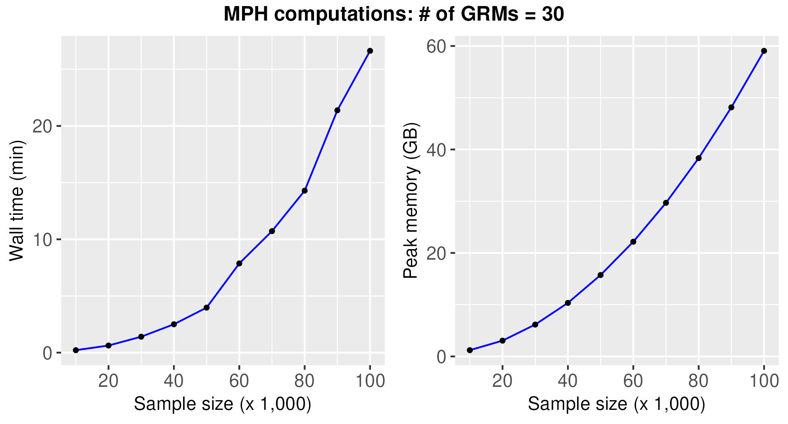

## Performance

Testing platform
- PowerEdge R640
    - Intel(R) Xeon(R) Gold 6258R CPU @ 2.70GHz
    - 8 x 64GB RDIMM, 3200MT/s, Dual Rank
    - SSD SAS Mix Use 12Gbps 512e 2.5in Hot-plug
- Red Hat Enterprise Linux 8.7 (Ootpa)

All the following tests used 14 threads (`--num_threads 14` in MPH). 

The following figure shows MPH's computational performance with a fixed sample size of 50,000 and a range of numbers of GRMs.

The following figure illustrates MPH's computational performance using a fixed set of 30 GRMs while varying the sample sizes.

